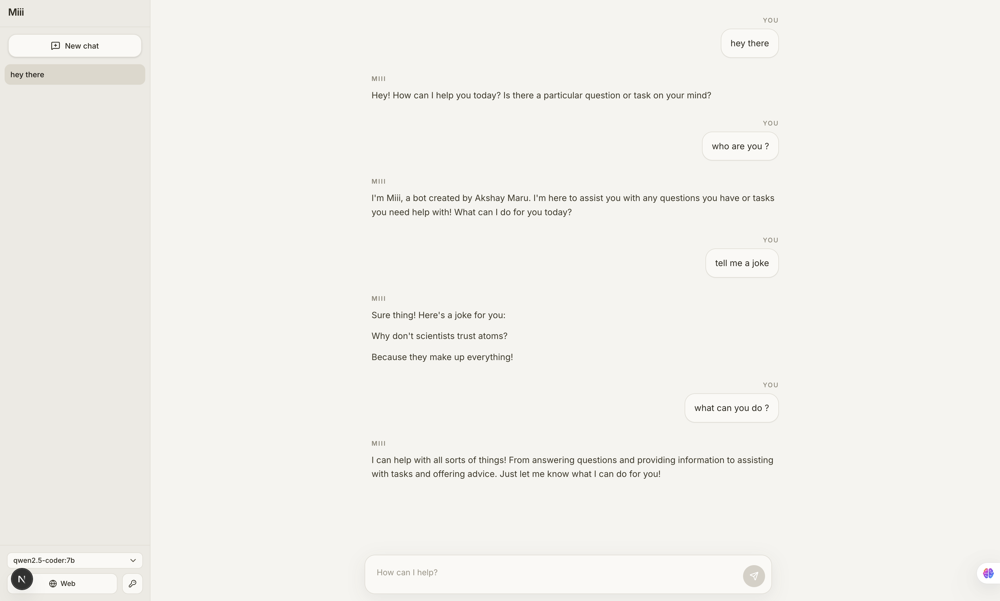
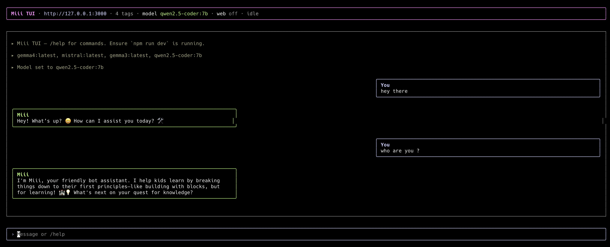

# Miii



> A local-first AI chat UI built to **simplify running LLMs locally** — with minimal setup and seamless usage.

miii is designed to **ease the installation and usage process**, eliminating the friction seen in tools like OpenClaw. With just a few integrations, it runs effortlessly via both a **Web UI and terminal**.

It talks to **[Ollama](https://ollama.com)** through **[LangGraph](https://langchain-ai.github.io/langgraphjs/)**, with streamed replies and Markdown rendering. Built with [Next.js](https://nextjs.org) (App Router), React 19, Tailwind CSS 4, and UI primitives.

**Author:** Akshay Maru


## Why miii?

Most local LLM tools require **complex setup, multiple dependencies, and fragmented workflows**.

miii solves this by providing:

- ⚡ **Minimal setup** — get started in minutes
- 🔌 **Few integrations** — no heavy configuration
- 🖥️ **Dual interface** — Web UI + Terminal (TUI)
- 🧠 **Local-first architecture** — privacy-focused by default
- 🚀 **Smooth developer experience** — streaming + Markdown out of the box

## Features

### Chat & models

- **Model picker** — Lists tags from your local Ollama server (`GET /api/models`).
- **Pull models** — Download an Ollama tag from the app (`POST /api/ollama/pull`, streaming NDJSON from Ollama). In the web UI: sidebar **Pull model** or **⌘⇧P / Ctrl+Shift+P**.
- **Streaming assistant responses** — NDJSON over `POST /api/chat` (`Accept: application/x-ndjson`).
- **Markdown in messages** — GFM via `react-markdown` + `remark-gfm`.
- **Miii persona** — Default system prompt in `lib/messages.ts`; you can override it **per conversation** in the sidebar (**System prompt**).
- **Conversations** — Multiple chats with titles derived from messages; state persisted in the browser (`localStorage`, see `lib/conversation-storage.ts`).
- **Edit & regenerate (web)** — Edit a user message or regenerate the last assistant reply from the message list.

### Tools & search

- **Optional web search** — When enabled, the stack can use **`tavily_web_search`** ([Tavily](https://tavily.com)) for live results. Requires a Tavily API key (saved in the browser and/or `TAVILY_API_KEY` on the server). Toggle **Web** in the sidebar or use slash commands (below).
- **Custom skills (tools)** — JSON definitions under `customTools/` are loaded as LangChain tools; manage them via `/api/custom-tools` and the in-app **Add tool** / **Delete tool** dialogs (or `/tools` / `/delete-tool`). Default execution is a **placeholder**; extend `skillToolFromDefinition` in `lib/custom-tools.ts` for real behavior.
- **LangGraph routing** — With no tools, the app streams directly from Ollama. When custom skills and/or Tavily are active, a LangGraph agent runs (`agent` → `tools` loop, `streamMode: "messages"`).

### RAG (Chroma)

- **Document context** — Optional **[Chroma](https://www.trychroma.com/)** collection per conversation. The last user message is embedded, relevant chunks are retrieved, and context is injected into the system message for that request.
- **Credentials** — Chroma Cloud / multi-tenant headers (token, tenant, database) can be set in the app and are sent with chat and RAG API calls; optional server-side defaults via env (see [Configuration](#configuration)).
- **Ingest** — **Index into Chroma** in the sidebar uploads pasted text or files (`POST /api/rag/ingest`); requires a running Chroma (e.g. `chroma run`) or reachable `CHROMA_URL`.

### Terminal UI (TUI)

- OpenClaw-style CLI: header (URL, model, web search, system/RAG hints, status), transcript, and input — same HTTP API as the browser (default base `http://127.0.0.1:3000`). See [Terminal UI](#terminal-ui).
- **Parity commands** — System prompt, RAG collection, Chroma headers, Tavily key for the session, **`/rag list`**, **`/pull <model>`**, **`/regenerate`**, etc. Use `/help` for the full list.

### Web UI shortcuts

| Shortcut | Action |
| -------- | ------ |
| **⌘N / Ctrl+N** | New chat |
| **⌘K / Ctrl+K** | Open model picker |
| **⌘/ / Ctrl+/** | Focus composer |
| **⌘⇧P / Ctrl+Shift+P** | Pull model dialog |

The composer supports a **slash menu** (type `/` at the start of a line) for quick inserts and actions (clear, tools, Tavily key, …).

## Prerequisites

- [Node.js](https://nodejs.org) 20+
- [Ollama](https://ollama.com) installed and running, with at least one model pulled (for example `ollama pull llama3.2`)
- For RAG: Chroma reachable locally or remotely; for embeddings, an Ollama embedding model (default `nomic-embed-text` unless overridden)


## Configuration

Environment variables (optional unless noted):

| Variable | Description |
|----------|-------------|
| `OLLAMA_BASE_URL` | Ollama API base URL (default: `http://127.0.0.1:11434`) |
| `TAVILY_API_KEY` | Tavily API key when web search is on and no client key is sent |
| `MIIIBOT_URL` | Base URL for the TUI client (default: `http://127.0.0.1:3000`) |
| `CHROMA_URL` | Chroma HTTP API base (default: `http://127.0.0.1:8000`) |
| `CHROMA_API_KEY` | Optional server default for Chroma token |
| `CHROMA_TENANT` | Optional server default tenant |
| `CHROMA_DATABASE` | Optional server default database |
| `OLLAMA_EMBED_MODEL` | Embedding model for RAG chunking/query (default: `nomic-embed-text`) |

Set values in `.env.local` as needed. For web search and Chroma headers you can also save values in the app (stored locally in the browser). The TUI reads `TAVILY_API_KEY` from the **shell** environment at startup and can override with `/tavily set` for the session.

## Terminal UI

With the app running (`npm run dev` or `npm run start`), open another terminal:

```bash
npm run tui
```

Defaults to **`http://127.0.0.1:3000`**. Override with:

```bash
MIIIBOT_URL=http://127.0.0.1:3000 npm run tui
npm run tui -- --url http://127.0.0.1:3000
```

Use **`/help`** inside the TUI for the full command list. Examples:

- **`/model`**, **`/url`**, **`/web on|off`**, **`/tavily set`** (with your API key)
- **`/system`**, **`/rag`**, **`/rag list`**, **`/chroma`**, **`/pull`** (e.g. `llama3.2`)
- **`/new`**, **`/clear`**, **`/clear all`**, **`/regenerate`**, **`/quit`**

Source: `scripts/miii-tui.tsx` (Ink); `npm run tui` bundles it with **esbuild** to ESM (`scripts/.tui-bundle.mjs`, gitignored).

Run the TUI in a **real interactive terminal** (not a pipe or some IDE panels); Ink needs stdin raw mode.

## Getting started

### One-line install (curl · global `miii`)

After you push this repo to GitHub:

```bash
curl -fsSL --proto '=https' --tlsv1.2 https://raw.githubusercontent.com/maruakshay/miii/main/scripts/install.sh | bash
```

* Fork/different repo:

```bash
curl ... | env MIII_REPO_URL=https://github.com/you/miibot.git bash -s
```

* Dry run:

```bash
curl ... | bash -s -- --dry-run
```

Requires **Git**, **Node.js 20+**, and **npm**.

### From a clone

```bash
npm install
npm run dev
```

---

## Scripts

| Command         | Description           |
| --------------- | --------------------- |
| `npm run dev`   | Development server    |
| `npm run build` | Production build      |
| `npm run start` | Run production server |
| `npm run lint`  | ESLint                |
| `npm run tui`   | Terminal UI           |


## Slash commands

### Web UI (composer)

Sending a message that is exactly one of these runs the action instead of chatting:

| Command | Action |
| ------- | ------ |
| `/clear` | Clear the current conversation’s messages |
| `/clear all` | Reset to default conversations (all chats) |
| `/tools` | Open **Add tool** (custom skill) |
| `/delete-tool` | Open **Delete tool** |
| `/web` | Open Tavily API key dialog |

The composer also supports a **`/` menu** (slash autocomplete) for the same actions and quick inserts.

### TUI

Type **`/help`** for the authoritative list. The TUI adds CLI-oriented commands (e.g. **`/rag list`**, **`/pull`**, **`/chroma`**, **`/regenerate`**) and points document **ingest** at the web UI where multipart upload is used.

## Project layout (high level)

| Path                          | Role |
| ----------------------------- | ---- |
| `app/api/chat`                | Stream chat (Ollama + optional tools/RAG) |
| `app/api/models`              | List models |
| `app/api/ollama/pull`         | Proxy Ollama model pull (streaming) |
| `app/api/rag/collections`     | List Chroma collections |
| `app/api/rag/ingest`          | Ingest text/files into a collection |
| `app/api/custom-tools`        | Manage JSON tools |
| `lib/chat-graph.ts`           | LangGraph logic |
| `lib/chat-tools.ts`           | Tool merging |
| `lib/custom-tools.ts`         | Tool definitions |
| `lib/rag-chroma.ts`           | Chroma client, query & ingest |
| `lib/tavily-tool.ts`          | Tavily integration |
| `lib/messages.ts`             | System prompts |
| `lib/conversation-storage.ts` | Local storage |
| `customTools/`                | JSON tools |
| `components/chat/`            | Chat UI |
| `scripts/miii-tui.tsx`        | TUI |
